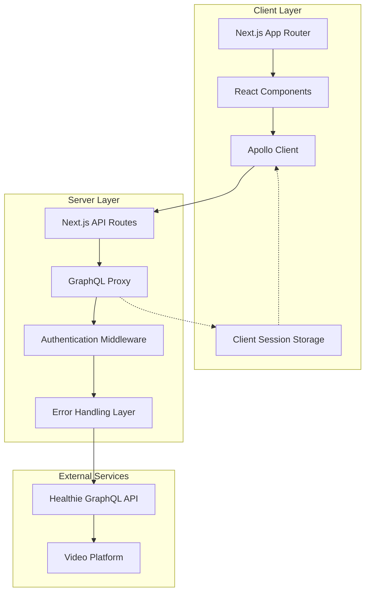

# Patient Portal System Design

## Overview

The Patient Portal System is a Next.js-based web application that provides a seamless interface for patients to authenticate, manage their healthcare information, complete required forms, and schedule appointments through integration with the Healthie EHR platform. The system follows a progressive disclosure pattern, guiding patients through three distinct phases while maintaining data consistency and security.

The architecture emphasizes client-side performance with server-side data integrity, utilizing Apollo GraphQL for efficient data management and implementing robust error handling patterns specific to Healthie's API characteristics. The design prioritizes accessibility, mobile responsiveness, and graceful degradation to ensure broad patient accessibility.

## Architecture

### System Architecture Diagram



### Technology Stack

**Frontend:**
- Next.js 14+ with App Router for file-based routing and server components
- React 18+ with TypeScript for type safety and developer experience
- Apollo Client for GraphQL state management and caching
- React Hook Form + Zod for form validation and type-safe schemas
- Tailwind CSS + shadcn/ui for consistent, accessible UI components
- React Context for cross-route state management

**Backend:**
- Next.js API Routes for server-side GraphQL proxy
- Apollo Server for GraphQL schema stitching and error handling
- JWT for session management with minimal PHI exposure
- Node.js crypto for secure token generation and validation

**Integration:**
- Healthie GraphQL API for all patient data operations
- Healthie's video platform integration for telehealth appointments
- IANA timezone database for accurate scheduling across timezones

## Components and Interfaces

### Authentication System

**AuthContext Provider**
```typescript
interface AuthContextType {
  session: ClientSession | null;
  login: (email: string, password: string) => Promise<LoginResult>;
  logout: () => void;
  isAuthenticated: boolean;
  isLoading: boolean;
}

interface ClientSession {
  sessionId: string;
  email: string;
  clientId?: string;
  expiresAt: number;
}
```

**Key Implementation Details:**
- Mock authentication table for Phase 1 with email/password validation
- Client-side session storage using localStorage with 30-minute idle timeout
- Automatic session renewal on activity with sliding window expiration
- Secure session token generation using crypto.randomUUID()
- Email normalization (toLowerCase().trim()) for consistent matching

### Patient Resolution Service

**PatientService Interface**
```typescript
interface PatientService {
  resolveOrCreatePatient(email: string): Promise<PatientResolution>;
  updatePatientDemographics(clientId: string, data: DemographicData): Promise<void>;
  getPatientBasicInfo(clientId: string): Promise<PatientBasicInfo>;
}

interface PatientResolution {
  clientId: string;
  isNewPatient: boolean;
  requiresOnboarding: boolean;
}
```

**Healthie Integration Patterns:**
- Use `createClient` mutation with required `dietitian_id` (provider assignment)
- Implement retry logic with exponential backoff for email verification queries
- Handle Healthie's eventual consistency with 2-3 second delays
- Never attempt DOB updates during initial patient creation (API limitation)
- Use `user` query with email filter for existing patient lookup

### Forms Management System

**FormManager Component Architecture**
```typescript
interface FormManagerProps {
  clientId: string;
  onFormsComplete: () => void;
}

interface FormStatus {
  formId: string;
  title: string;
  status: 'pending' | 'in_progress' | 'submitted';
  completionPercentage: number;
  lastUpdated: Date;
  templateId: string;
}
```

**Form State Management:**
- React Context for cross-route form state persistence
- Optimistic UI updates with server synchronization
- Autosave functionality with 300ms debounce on field blur
- Form validation using Zod schemas with real-time feedback
- Progress calculation based on required field completion

**Healthie Form Integration:**
- Use `formAnswerGroups` query to fetch existing submissions
- Store responses using structured intake templates via `createFormAnswerGroup`
- Implement form template ID mapping per environment (dev/staging/prod)
- Prefill forms from existing `FormAnswerGroup` data
- Handle form versioning and template updates gracefully

### Scheduling System

**SchedulingService Interface**
```typescript
interface SchedulingService {
  getAppointmentTypes(providerId: string): Promise<AppointmentType[]>;
  getAvailableSlots(typeId: string, timezone: string): Promise<TimeSlot[]>;
  bookAppointment(request: BookingRequest): Promise<BookingConfirmation>;
  getAppointmentDetails(appointmentId: string): Promise<AppointmentDetails>;
}

interface TimeSlot {
  startTime: Date;
  endTime: Date;
  timezone: string;
  available: boolean;
  providerId: string;
}
```

**Scheduling Implementation Details:**
- Use Healthie's client self-booking flow via `completeCheckout` mutation
- Set `contact_mode: 'video'` to automatically generate video meeting links
- Implement timezone normalization with proper DST handling
- Cache appointment types per session to reduce API calls
- Handle concurrent booking conflicts with user-friendly error recovery
- Poll appointment status for video link availability before appointment start

### Error Handling and Resilience

**Error Classification System**
```typescript
enum ErrorType {
  VALIDATION = 'validation',
  NETWORK = 'network',
  GRAPHQL = 'graphql',
  BUSINESS_LOGIC = 'business_logic',
  AUTHENTICATION = 'authentication'
}

interface ErrorHandler {
  classifyError(error: unknown): ErrorType;
  getRecoveryActions(error: ClassifiedError): RecoveryAction[];
  logError(error: ClassifiedError, context: ErrorContext): void;
}
```

**Resilience Patterns:**
- Apollo Client error policies returning partial data with errors
- Exponential backoff retry for transient network failures (max 3 attempts)
- Circuit breaker pattern for Healthie API rate limiting
- Graceful degradation with offline indicators and cached data
- User-friendly error messages with specific recovery guidance

## Data Models

### Client Session Model
```typescript
interface ClientSession {
  sessionId: string;
  email: string;
  clientId?: string;
  providerId?: string;
  expiresAt: number;
  lastActivity: number;
  deepLinkDestination?: string;
}
```

### Patient Data Model
```typescript
interface PatientData {
  clientId: string;
  email: string;
  firstName?: string;
  lastName?: string;
  dateOfBirth?: string;
  gender?: string;
  phoneNumber?: string;
  timezone?: string;
  metadata?: Record<string, unknown>;
}
```

### Form Submission Model
```typescript
interface FormSubmission {
  formAnswerGroupId: string;
  customModuleFormId: string;
  fillerId: string;
  status: FormStatus;
  answers: FormAnswer[];
  submittedAt?: Date;
  lastModified: Date;
}

interface FormAnswer {
  questionId: string;
  answer: string | string[] | number | boolean;
  questionType: 'text' | 'select' | 'multiselect' | 'number' | 'date';
}
```

### Appointment Model
```typescript
interface Appointment {
  id: string;
  appointmentTypeId: string;
  providerId: string;
  clientId: string;
  startTime: Date;
  endTime: Date;
  timezone: string;
  contactMode: 'video' | 'phone' | 'in_person';
  status: 'scheduled' | 'confirmed' | 'completed' | 'cancelled';
  videoLink?: string;
  joinInstructions?: string;
}
```

## Error Handling

### Healthie-Specific Error Patterns

**Patient Creation Errors:**
- Missing `dietitian_id`: Pre-flight validation with environment config
- Duplicate email detection: Implement email verification with retry logic
- DOB update failures: Separate DOB updates from initial patient creation
- Provider assignment errors: Validate provider IDs before patient creation

**Form Submission Errors:**
- Template ID mismatches: Environment-specific template mapping
- Validation failures: Field-level error display with recovery guidance
- Concurrent submission conflicts: Optimistic updates with rollback capability
- Missing required fields: Real-time validation with progress indicators

**Scheduling Errors:**
- Slot conflicts: Real-time availability checks with conflict resolution
- Timezone conversion errors: Robust timezone handling with fallbacks
- Provider availability changes: Graceful handling of scheduling rule updates
- Video link generation delays: Polling mechanism with timeout handling

### Error Recovery Strategies

**Network Resilience:**
- Automatic retry with exponential backoff for transient failures
- Offline detection with cached data fallbacks
- Request queuing for when connectivity is restored
- User notification of network status changes

**Data Consistency:**
- Optimistic UI updates with server reconciliation
- Conflict resolution for concurrent form edits
- Session recovery after network interruptions
- Data validation at multiple layers (client, server, API)

## Testing Strategy

### Unit Testing Approach
- Jest + React Testing Library for component testing
- Mock Service Worker (MSW) for API mocking
- Zod schema validation testing for form inputs
- Apollo Client MockedProvider for GraphQL testing
- Timezone-specific testing for scheduling components

### Integration Testing Strategy
- End-to-end patient journey testing with Playwright
- Healthie API integration testing with test environment
- Form submission and retrieval workflow testing
- Appointment booking flow testing with mock video platform
- Error scenario testing with network simulation

### Accessibility Testing
- Automated accessibility testing with axe-core
- Screen reader compatibility testing
- Keyboard navigation testing for all interactive elements
- Color contrast validation for visual elements
- Mobile accessibility testing across devices

### Performance Testing
- Core Web Vitals monitoring and optimization
- GraphQL query performance analysis
- Form autosave performance under load
- Scheduling system responsiveness testing
- Mobile performance optimization validation

## Security Considerations

### Data Protection
- Minimal PHI in client-side storage (email and session ID only)
- Server-side GraphQL proxy to protect API tokens
- Secure session token generation and validation
- Automatic session expiration with sliding window renewal
- HTTPS enforcement for all communications

### Authentication Security
- Password validation with complexity requirements
- Rate limiting for authentication attempts
- Session fixation protection with token rotation
- Secure logout with complete session cleanup
- Deep link validation against allowlist

### API Security
- Server-side API token management
- Request sanitization and validation
- GraphQL query complexity analysis
- Rate limiting for API requests
- Error message sanitization to prevent information leakage

## Deployment and Infrastructure

### Environment Configuration
- Development: Mock authentication with test Healthie environment
- Staging: Full Healthie integration with staging data
- Production: Production Healthie environment with monitoring

### Monitoring and Observability
- Application performance monitoring (APM)
- Error tracking with sanitized PHI-free logs
- User journey analytics with privacy compliance
- API response time and error rate monitoring
- Real-time alerting for critical system failures

### Scalability Considerations
- Next.js static generation for public pages
- Apollo Client caching strategy for reduced API calls
- CDN distribution for static assets
- Database connection pooling for session management
- Horizontal scaling capability for increased load